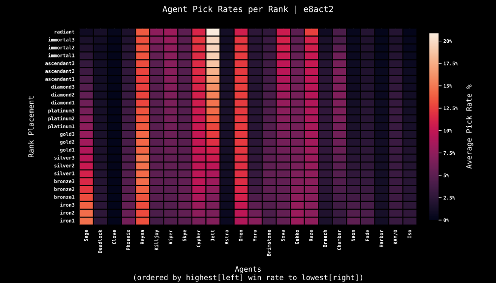

# valorant-agent-stats

Comparing Valorant agent pick rates between ranks in competitive queue.

Latest data: episode 8 act 2\
Earliest data: episode 2 act 1

## planned for future

- [ ] Pull stats from pro-play to compare with ranked.
- [ ] Analyze agent pick rates across episodes/acts.
- [ ] Analyze change in pick rates based on agent buffs/nerfs, new agents/maps, and evolving meta from observing pro-play strategies.
